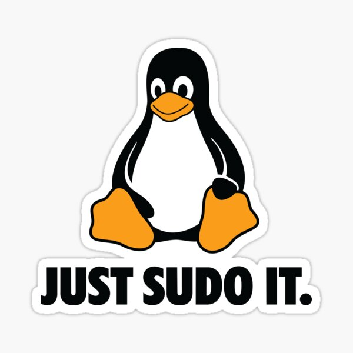

## 👋 Hi, I'm Suad

#### DevOps Engineer | AWS • Linux • Bash • Docker • Terraform • CI/CD • Kubernetes
*Building and automating cloud infrastructure on AWS*

---


<!-- Add your profile image here -->
<p align="center">
  
</p>

<p align="center">
  <a href="https://www.linkedin.com/in/suad-k-frlj/">
    
  </a>
</p>

---

#### About Me
I’m a **DevOps Engineer** with a strong focus on AWS, Linux, and automation.  
I build production-minded systems where **security, reliability, and clear architecture** are default, not afterthoughts.

I enjoy:
- designing cloud infrastructure that is actually operable
- automating away manual and repetitive work
- building systems that are easy to understand, scale, and maintain

**Fun fact:**  
My nickname is **Sudo**, not because I overuse it, but because I actually got it from my uncle.  
**Sudo** is a popular nickname for the name Suad in Bosnia😄

---

#### Recent Project
- [**KubeMemos - Production-Grade Memos on AWS EKS**](https://github.com/sudo-suadKF/KubeMemos-EKS)

---

#### Featured Projects

- [**KubeMemos - Production-Grade Memos on AWS EKS**](https://github.com/sudo-suadKF/KubeMemos-EKS)
  Production-grade K8s platform for running Memos on **Amazon EKS** using **Terraform, Helm, Argo CD, and GitHub Actions**. Features GitOps, automated secret management and rotation, observability, and security-first CI/CD with infrastructure validation and cost analysis.


- [**SentinelStack Gatus - Production-Grade Monitoring on AWS**](https://github.com/sudo-suadKF/SentinelStack-Gatus)  
  Production-grade container platform built with **ECS Fargate, Terraform, and GitHub Actions**. Implements private networking, OIDC-based CI/CD, image scanning, and least-privilege IAM.

- [**CloudPress HA - Multi-AZ WordPress Infrastructure on AWS (Terraform)**](https://github.com/sudo-suadKF/CloudPress-HA)  
  Highly available WordPress architecture using **ALB, Docker, EC2, RDS, and Terraform**. Designed with strong security, private networking, and production-style best practices.

---

#### Tech Stack - Languages & Tools

<p align="left">
  
</p>

---

#### Let’s Connect
<p align="left">
  <a href="https://www.linkedin.com/in/suad-k-frlj/">
    
  </a>
</p>

---

#### Final Note
Never run this in production:

```bash
sudo rm -rf /
```
…but if you understand why this is a bad idea, we’ll probably get along just fine😉

